# 🎓 Student Management System

<div align="center">


*A comprehensive desktop application for managing student records, courses, and results with an intuitive GUI interface.*

</div>

## ✨ Features

- 🏫 **Course Management** - Add, edit, and delete courses
- 👨‍🎓 **Student Management** - Comprehensive student record handling
- 📊 **Result Management** - Track and manage student results
- 📈 **Reporting System** - Generate detailed reports and analytics
- 🔐 **User Authentication** - Secure login system
- 📱 **Responsive GUI** - Clean and intuitive user interface
- 💾 **Database Integration** - Efficient SQLite database operations
- 🔄 **Real-time Updates** - Live count updates for records

## 🖼️ Screenshots

```
┌─────────────────────────────────────────────────────────────┐
│                Student Management System                    │
├─────────────────────────────────────────────────────────────┤
│ [Course] [Student] [Result] [View] [Logout] [Exit]         │
├─────────────────────────────────────────────────────────────┤
│                                                             │
│              Welcome to Management System                   │
│                     [Background Image]                      │
│                                                             │
├─────────────────────────────────────────────────────────────┤
│ [Total Courses] [Total Students] [Total Results]           │
│      [15]           [245]           [180]                   │
└─────────────────────────────────────────────────────────────┘
```

## 🏗️ System Architecture

```mermaid
graph TD
    A[👤 User Login] --> B[🏠 Main Dashboard]
    B --> C[📚 Course Management]
    B --> D[👨‍🎓 Student Management]
    B --> E[📊 Result Management]
    B --> F[📈 View Student Reports]
    
    C --> G[(SQLite Database)]
    D --> G
    E --> G
    F --> G
    
    H --> B
    
    C --> I[✏️ Add/Edit/Delete Courses]
    D --> J[✏️ Add/Edit/Delete Students]
    E --> K[✏️ Add/Edit/Delete Results]
```



## 🔄 Application Workflow

```mermaid
flowchart LR
    START([🚀 Start Application]) --> LOGIN[🔐 Login Screen]
    LOGIN --> |Valid Credentials| DASHBOARD[🏠 Main Dashboard]
    LOGIN --> |Invalid| LOGIN
    
    DASHBOARD --> COURSE[📚 Course Tab]
    DASHBOARD --> STUDENT[👨‍🎓 Student Tab]
    DASHBOARD --> RESULT[📊 Result Tab]
    DASHBOARD --> REPORT[📈 Report Tab]
    
    COURSE --> |CRUD Operations| DB[(🗄️ Database)]
    STUDENT --> |CRUD Operations| DB
    RESULT --> |CRUD Operations| DB
    REPORT --> |Read Operations| DB
    
    DB --> UPDATE[🔄 Update Statistics]
    UPDATE --> DASHBOARD
    
    DASHBOARD --> LOGOUT[🚪 Logout]
    LOGOUT --> END([🔚 End])
```



## 📁 Project Structure

```
student-management-system/
│
├── 📄 main.py              # Main dashboard application
├── 🔐 login.py             # User authentication system
├── 📚 course.py            # Course management module
├── 👨‍🎓 student.py            # Student management module
├── 📊 result.py            # Result management module
├── 📈 report.py            # Report generation module
├── 🗄️ database.py          # Database connection and operations
│
├── 🖼️ assets/              # Images and resources
│   ├── logo_p.png         # Application logo
│   └── bg.png             # Background image
│
├── 📋 requirements.txt     # Python dependencies
└── 📖 README.md           # This file
```

## 🔧 How the Project Works

### 🏗️ **Architecture Overview**

The Student Management System follows a **modular architecture** where each component handles specific functionality:

1. **`main.py`** - The central hub that creates the main dashboard interface with navigation buttons and real-time statistics display
2. **`login.py`** - Handles user authentication before accessing the main system
3. **`database.py`** - Manages all database connections and operations using SQLite
4. **Individual modules** (`course.py`, `student.py`, `result.py`, `report.py`) - Each handles specific business logic

### 🔄 **Application Flow**

1. **Startup** → User runs `login.py` to authenticate
2. **Authentication** → Valid credentials launch `main.py` dashboard
3. **Dashboard** → Central interface with 6 main buttons (Course, Student, Result, View, Logout, Exit)
4. **Module Access** → Each button opens a separate Tkinter window for specific operations
5. **Database Operations** → All modules interact with SQLite database through `database.py`
6. **Real-time Updates** → Statistics automatically refresh when records are modified

### 💾 **Data Management**

- **SQLite Database** stores all course, student, and result information
- **CRUD Operations** (Create, Read, Update, Delete) available for all entities
- **Relational Design** with proper foreign key relationships between tables
- **Real-time Statistics** showing total counts of courses, students, and results

### 🖥️ **User Interface**

- **Tkinter-based GUI** with modern styling and professional appearance
- **Modular Windows** - each function opens in its own popup window
- **Visual Feedback** - buttons, colors, and images provide intuitive navigation
- **Responsive Design** - adapts to different screen sizes and maintains usability

## 🚀 Installation & Setup

### Prerequisites

- Python 3.7 or higher
- pip (Python package installer)

### Step 1: Clone the Repository

```bash
git clone https://github.com/yourusername/student-management-system.git
cd student-management-system
```

### Step 2: Create Virtual Environment (Recommended)

```bash
# Create virtual environment
python -m venv venv

# Activate virtual environment
# On Windows:
venv\Scripts\activate
# On macOS/Linux:
source venv/bin/activate
```

### Step 3: Install Dependencies

```bash
pip install -r requirements.txt
```

### Step 4: Setup Database

```bash
# The database will be automatically created on first run
# Make sure you have proper permissions in the project directory
```

### Step 5: Run the Application

```bash
# Start with login screen
python login.py

```


## 🎯 Usage Guide

### 1. **Login**
- Start the application using `python login.py`
- Enter your credentials to access the system

### 2. **Dashboard Navigation**
- **Course**: Manage course information
- **Student**: Add and manage student records
- **Result**: Input and track student results
- **View**: Generate reports and analytics
- **Logout**: Securely exit to login screen
- **Exit**: Close the application

### 3. **Managing Records**
- Use the respective tabs to perform CRUD operations
- All changes are automatically saved to the database
- Statistics are updated in real-time


### Database Schema

```sql
-- Courses table
CREATE TABLE courses (
    id INTEGER PRIMARY KEY,
    name TEXT NOT NULL,
    description TEXT
);

-- Students table
CREATE TABLE students (
    id INTEGER PRIMARY KEY,
    name TEXT NOT NULL,
    email TEXT UNIQUE,
    course_id INTEGER,
    FOREIGN KEY (course_id) REFERENCES courses (id)
);

-- Results table
CREATE TABLE results (
    id INTEGER PRIMARY KEY,
    student_id INTEGER,
    course_id INTEGER,
    marks INTEGER,
    FOREIGN KEY (student_id) REFERENCES students (id),
    FOREIGN KEY (course_id) REFERENCES courses (id)
);
```

---

<div align="center">

**⭐ Built for Efficient Management ⭐**

</div>
